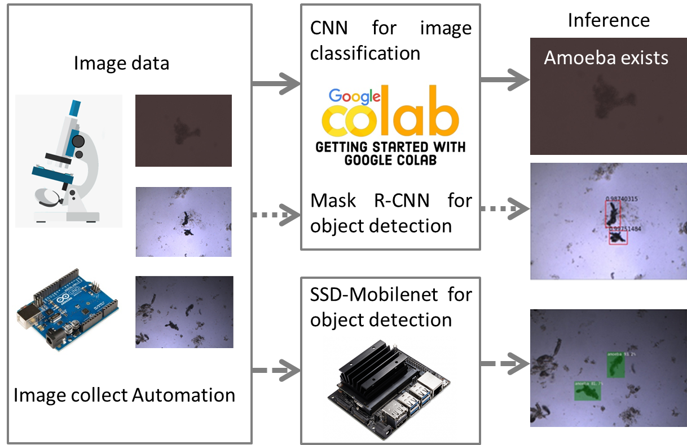

  

  

# **Workshop on computer vision for analytical chemists: classification and detection of amoebae using optical microscopy image analysis with machine learning**

This is a workshop for computer vision using machine learning. Students will learn to classify, detect and analyze microorganisms like amoebae in optical microscopic images with machine learning model. Students will know how to setup environment for computer vision, load images dataset, data preparation, train custom model, evaluate the model and run prediction on new images with trained model. The workshop content includes image classification using machine learning (section 1), object detection in Google Colab using Mask R-CNN model (section 2), object detection in Jetson Nano using SSD-Mobilenet model (section 3). This requires that the students possess the knowledge of Python basics elements and data analysis with Python. 

## Students prerequisites
The workshop is designed to teach analytical chemistry students to classify and detect microorganisms, such as amoebae, in microscopic images. This requires that the students possess the knowledge of Python basics elements and data analysis with Python. An introduction to these topics is already published in the Journal of Chemical Education by Lafuente etc. Students are encouraged to check their tutorial in Github (https://github.com/ML4chemArg/Intro-to-Machine-Learning-in-Chemistry). Some basic knowledge of statistics, analytical chemistry and biology would also be helpful as applied to the optical microscopy operation and concentration analysis, but is not required. 

## Workshop contents 
The three section notebooks provide the descriptive words for almost every code cells to let instructors and students understand what the code means. And they can also watch the video recorded by our lab (https://www.youtube.com/playlist?list=PL5po4e4yJQICA82j2ja6_2gjBaEzQ4kue). The three sections are described below. 
### Section 1 Notebooks: Image classification with machine learning
The notebooks in `section1_imageClassificationWithML` folder focuses on teaching students the basic image classification and workflow of computer vision using machine learning. In an example notebook, students will learn to train an ML model to classify different clothes images from [Fashion_MNIST dataset](https://github.com/zalandoresearch/fashion-mnist). As an assignment based on this example, the students will then train the model and use the trained model to distinguish if an image contains an amoeba or not; an appropriate dataset (collected in our lab) will be provided in `dataset-section1`. The solution notebook is also provided to allow the students check their answer.
We use Keras as the start of this topic, since Keras is simple, flexible and powerful to start for students. Keras is a deep learning API written in Python, running on top of the machine learning platform Tensorflow. More information about Keras can refer to the [Keras doc](https://keras.io/about/). 

### Section 2 Notebooks: Object detection with Mask R-CNN
The notebook in `section2_objectDetectionWithMaskRCNN` folder presents one network that can run object detection for the images. At first, one example referred from the [Mask R-CNN github](https://github.com/matterport/Mask_RCNN/tree/master/samples ) and [the blog](https://machinelearningmastery.com/how-to-train-an-object-detection-model-with-keras/ ) is introduced to students to learn how Mask R-CNN works in an example notebook. Then, the amoebae images are used to train a Mask R-CNN model and the trained model is used to distinguish the position and number of amoebae in one image. We collected a series of images depicting one water drop with the help of automated device, and the amoebae in the drop could then be analyzed by the trained Mask R-CNN model. The inference images for analysis of the amoeba in the water drop are provided in the `myResults` folder. The bonus notebook is also included to let students distinguish two types of amoebae like *A. proteus* and *N. fowleri*. The dataset used for Mask R-CNN is provided in `dataset-section2`. 

Mask R-CNN is implemented on Python 3, Keras, Tensorflow. The model generates bounding boxes and segmentation masks for each instance of an object in the image. It's based on Feature Pyramid Network (FPN) and a ResNet101 backbone. We choose Mask R-CNN as second section, because the API and platform Mask R-CNN uses is the same with level 1 and Mask R-CNN is one of the most important frameworks as it has been demonstrated to be accurate, flexible and efficient, and also simple to implement. It has become very popular since its development in 2017.

### Section 3 Tutorials: Object detection using Jetson Nano
The Section 3 tutorial in `section3_objectDetectionUsingJetsonNano` folder mainly introduces students to running object detection using Jetson Nano. At First, they need to know how command line arguments work in Python before attempting the exercises. Afterwards, students can run the amoeba detection example using [Jetson Inference project](https://github.com/dusty-nv/jetson-inference). Students are encouraged to follow `section3_objectDetectionUsingJetsonNano/Jetson Nano tutorial.md` to finish the exercises. The dataset used in the Jetson Nano exercise is the same as the one for Mask R-CNN and is provided in `dataset-section3`. 

 

## Other information:
### Amoebae Datasets: 
Images were collected with a microscope camera (QImaging Go-3, Teledyne Photometrics, USA) . The images need to convert from .TIF format to .jpg format. And the python code that can perform this job is provided in `tools/TIFtoJPG` folder. For object detection, the images are labeled and converted into the Pascal Visual Object Challenge (VOC) data type.  The amoebae in the images were labeled with the open source tool LabelImg in GitHub (Tzutalin, LabelImg, Git code (2015), https://github.com/tzutalin/labelImg). We can use code in `tools/amoebaDataset-visualization` and `tools/amoebaProFowDataset-visualization`folder to visualize the labeled images. All datasets that are used for three sections are provided in `dataset-section1`, `dataset-section2`, `dataset-section3` folder. The Google Colab notebook will load the specific dataset automatically. More descriptions about our datasets are in the paper and SI. 

### Arduino: 
Arduino Uno stepper motor is used to control the movement of table to image the whole drops. The code is contained in the folder `tools/arduino/uno_steppermotor`. For setting up the Arduino, the tutorials are recommended: https://www.youtube.com/playlist?list=PLGs0VKk2DiYw-L-RibttcvK-WBZm8WLEP. 

 

## Workshop videos
Welcome to watch our workshop videos: 

