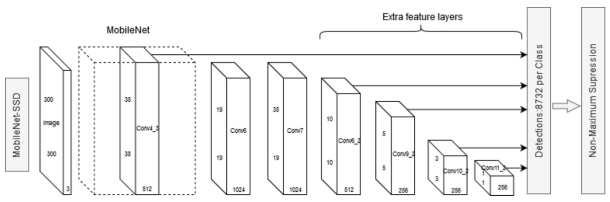
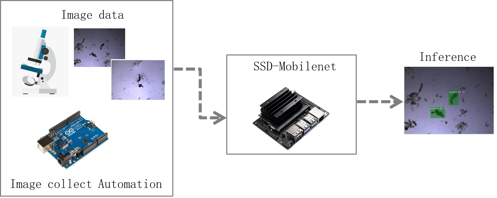
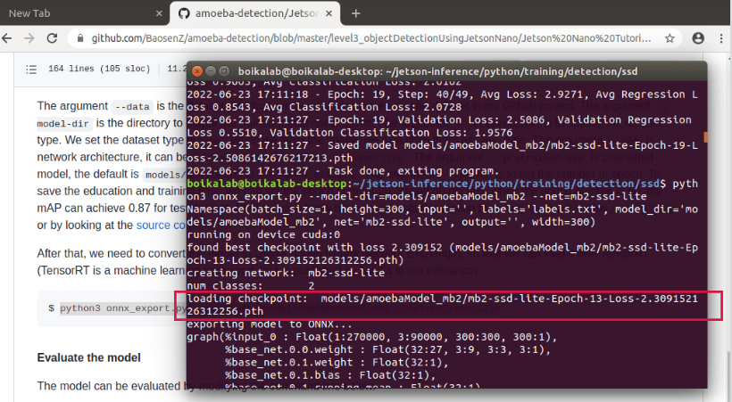

# Jetson Nano Tutorials


## Object Detection in Jetson Nano Introduction

This document is the detailed tutorials for Level 3 that is about training our own SSD-Mobilenet object detection model (Figure 1) in Jetson Nano. The [SSD-Mobilenet](https://arxiv.org/abs/1512.02325) is a popular network architecture for real-time object detection on mobile and embedded devices. The SSD-Mobilenet combines the SSD-300 Single-Shot MultiBox Detector with a Mobilenet backbone. 

<p align="center">
  
    <p align="center">
        Figure 1. SSD-Mobilenet architecture
</p>
</p>


At first, students need to learn Linux command line basics (check 'The Linux command line basics' section) and know how to run the command line in Jetson Nano device. Then, students follow the tutorials in 'Example: Amoeba Detection' to load the dataset, train and evaluate the model, run inference for test dataset and the drop. For the Bonus part (check 'Bonus: Amoebae A. Proteus and N. Fowleri Detection' section), students follow the same procedure to differentiate two types of amoeba with the command line with the dataset of A. Proteus and N. Fowleri that we provided. 

<p align="center">
  
    <p align="center">
        Figure 2. Object detection using Jetson Nano
</p>
</p>


> Note that if students get a new Jetson Nano device, they will take time to boot Jetson Nano device and install Jetson Inference project on it. For booting Jetson Nano device, the [tutorials](https://developer.nvidia.com/embedded/learn/get-started-jetson-nano-devkit#prepare) are provided in the Nvidia website. The Jetson inference project includes some deep learning networks for image classification, object detection, and semantic segmentation. Various pre-trained deep learning models are automatically downloaded to get you up and running quickly. We can also train new models with the pre-trained networks to get our own custom model. The details of installation process can be referred to the [source](https://github.com/dusty-nv/jetson-inference/blob/master/docs/building-repo-2.md ) and the [video](https://www.youtube.com/watch?v=5rbOsKCZ-VU&list=PLGs0VKk2DiYxP-ElZ7-QXIERFFPkOuP4_&index=49&ab_channel=PaulMcWhorter ). Make sure the jetson-inference project download in `desktop`. 

<p>
</p>


## The Linux command line basics

One of the early operating systems is called Unix. At that time, there was no mouse, no fancy graphics, not even any choice of color, but programmer produce text as output and accept text as an input via Unix mainframe. Linux is a sort-of-descendent of Unix. The core part of Linux is designed to behave similarly to a Unix System. The Linux command line, like Unix mainframe, is a text interface to your computer. Although running Windows graphical programs is more common in the recent days, learning text interface of Linux command line is still meaningful, since it can let us understand more underlying logic of the computer. This will also increase our efficiency dealing with computer programs after being familiar with Linux command line. 

The command can finish tasks like changing directories (cd), listing the contents (ls), moving files (mv), and so on. Here, we provide the common used command line as a cheat sheet for students to have a quick reference (Table 1). The Figure 3 is the example of Linux command line terminal. Students are encouraged to type the Linux command line in Figure 3 to become familiar with it. 

 

Table 1. Common used Linux command line: 

| Linux command line | Explanation                             |
| ------------------ | --------------------------------------- |
| $ pwd              | Show current directory                  |
| $ mkdir dir        | Make directory called dir               |
| $ rm –r dir        | Delete directory called dir             |
| $ cd dir           | Change directory to dir                 |
| $ cd ..            | Go up a directory                       |
| $ ls               | List files                              |
| $ touch file1      | Create a file called file1              |
| $ file file1       | Get type of file1                       |
| $ cp file1 file2   | Copy file1 to file2                     |
| $ mv file1 file2   | Move file1 to file2                     |
| $ rm file1         | Delete file1                            |
| $ ctrl-c           | Stop current command                    |
| $ clear            | Clear all command line                  |
| Tab                | Fill out the command line automatically |

 

<p align="center">
  
    <p align="center">
        Figure 3. Linux command line terminal
</p>
</p>


## Example: Amoeba Detection

After installation of the Jetson Inference project, students can start amoeba detection example. We will follow nearly same workflow with Level 1 and level 2: load images dataset, train the model, evaluate the model, inference. 

<b> Load images dataset </b>
The code for SSD is under the directory `jetson-inference/python/training/detection/ssd`, if you build your `jetson-inference` project under the `desktop`.  When we load images dataset, change the directory to correct the folder by typing the command line below at first, then download the `amoeba-detection` project from [our Github](https://github.com/BaosenZ/amoeba-detection.git): 


```
$ cd jetson-inference/python/training/detection/ssd
$ git clone https://github.com/BaosenZ/amoeba-detection.git
```

Note that we need to make sure the internet is connected by connecting the internet port, since the project is downloaded from the internet. 

<p>
</p>

<b>Train the model </b>

Before training, make sure the current directory is under `jetson-inference/python/training/detection/ssd`. The model will start to train by typing the command line below: 

```
$ python3 train_ssd.py --data=amoeba-detection/dataset-level3/amoebaDataset/trainingDataset --model-dir=models/amoebaModel_mb2 --dataset-type=voc --net=mb2-ssd-lite --pretrained-ssd=models/mb2-ssd-lite-mp-0_686.pth --epochs=20
```

>Note that if you run out of memory or your process is "killed" during training, close the extra windows/process and try [Mounting SWAP](https://github.com/dusty-nv/jetson-inference/blob/master/docs/pytorch-transfer-learning.md#mounting-swap) to save memory. 

The argument `--data` is the dataset directory, we need to locate the amoeba dataset in my Github project. The argument `--model-dir` is the directory to output the trained model checkpoints. The argument `--dataset-type` is to specify the dataset type. We set the dataset type is `voc`. When we label the image, we also label them as `voc` type. The argument `--net` is network architecture, it can be `mb1-ssd`, `mb1-lite-ssd`, `mb2-ssd-lite`. The argument `--pretrained-ssd` is pretrained model, the default is `models/mobilenet-v1-ssd-mp-0_675.pth`.  The argument `--epochs` is to set the number of epoch. To save the education and training time, we can set the epoch number 20. Based on my test, when the epoch number is 60, the mAP can achieve 0.87 for test dataset. Students can know more arguments description by typing `python3 train_ssd.py -h` for help or by looking at the [source code](https://github.com/dusty-nv/pytorch-ssd/blob/3f9ba554e33260c8c493a927d7c4fdaa3f388e72/train_ssd.py). 


After that, we need to convert the model to ONNX (Open Neural Network Exchange), so that we can load it with TensorRT (TensorRT is a machine learning framework that is published by Nvidia to run inference): 
```
$ python3 onnx_export.py --model-dir=models/amoebaModel_mb2 --net=mb2-ssd-lite
```

<p>
</p>

<b>Evaluate the model </b>

The model can be evaluated by modifying the command line below. 

```
$ python3 eval_ssd.py --net=mb2-ssd-lite --eval_dir=evals/evals_amoebaEval --label_file=models/amoebaModel_mb2/labels.txt --dataset=amoeba-detection/dataset-level3/amoebaDataset/testDataset  --trained_model=models/amoebaModel_mb2/<mb2-ssd-lite-.pth>
```

The `--trained-model` path need to be replaced by the best trained model file with lowest loss. From the figure 2 (screen shot after converting the best trained model to ONNX), we find out the best trained model is from epoch 30. So, in our situation, the `--trained_model=models/amoebaModel_mb2/<mb2-ssd-lite-.pth>` need to be replaced by `--trained_model=models/amoebaModel_mb2/mb2-ssd-lite-Epoch-13-Loss-2.309152126312256.pth`. 

<p align="center">
  
    <p align="center">
        Figure 4. Screen shot of model evaluation
</p>
</p>

<p>
</p>

<b>Inference</b>

After getting the trained model, we can run inference for test dataset and drop images. The inference images are in the directory of`jetson-inference/python/training/detection/ssd/amoeba-detection/level3-objectDetectionUsingJetsonNano/inference`. If we want to run the inference for test dataset, go to `testDataset-inference` directory by running the command line below. 

```
$ cd amoeba-detection/level3_objectDetectionUsingJetsonNano/inference/testDataset-inference
```

If we want to run the inference for drop1, go to the `drop1-inference` directory by running the command line below. 

```
$ cd amoeba-detection/level3_objectDetectionUsingJetsonNano/inference/drop1-inference
```
Then, run the command line below in specific folder. We will get the predicted images. 
```
$ python3 predImages.py
```
The inference results will generate in the folder `amoeba-detection/level3-objectDetectionUsingJetsonNano/inference/testDataset-inference` for test dataset. The inference results that we tried are shown in the `amoeba-detection/results` folder or the Figure S6-10 in supporting information.
<p>
</P>
## Bonus: Amoebae A. Proteus and N. Fowleri Detection

Based on the command line and python code in Box 2, 3 in the Example, students can train, evaluate and do inference for the A. proteus and N.fowleri amoeba dataset.

```
# change the directory
$ cd jetson-inference/python/training/detection/ssd

# Start to train the model 
$ python3 train_ssd.py --data=amoeba-detection/dataset-level3/amoebaProFowDataset/trainingDataset --model-dir=models/amoebaProFowModel_mb2 --dataset-type=voc --net=mb2-ssd-lite --pretrained-ssd=models/mb2-ssd-lite-mp-0_686.pth --epochs=100

# Convert the model to ONNX 
$ python3 onnx_export.py --model-dir=models/amoebaProFowModel_mb2 --net=mb2-ssd-lite

# Evaluate the model (remember to replace the trained_model path)
$ python3 eval_ssd.py --net=mb2-ssd-lite --eval_dir=evals/evals_amoebaProFowEval --label_file=models/amoebaProFowModel_mb2/labels.txt --dataset=amoeba-detection/dataset-level3/amoebaProFowDataset/testDataset --trained_model=models/amoebaProFowModel_mb2/<mb2-ssd-lite-.pth>

# Inference of test dataset
$ cd amoeba-detection/level3_objectDetectionUsingJetsonNano/inferenceProFow
$ python3 predImages.py
```

<p>
</P>


## More learning resources

* This is the original source of Jetson inference. They provide detailed tutorials of how to use the Jetson Nano or other NVIDIA product to train or do inference: [**https://github.com/dusty-nv/jetson-inference**](https://github.com/dusty-nv/jetson-inference).
* This is a Jetson Nano tutorial. It is friendly to the beginner: https://www.youtube.com/playlist?list=PLGs0VKk2DiYxP-ElZ7-QXIERFFPkOuP4_&ab_channel=PaulMcWhorter. 
* Ubuntu is one kind of Linux system and they provide command line tutorial for beginners: https://ubuntu.com/tutorials/command-line-for-beginners#9-conclusion.
* Command line books: http://linuxcommand.org/tlcl.php.
* Beginner-friendly Linux command line learning resources can also check the video in YouTube: https://www.youtube.com/watch?v=MfpvdC-QrgY&list=PLGs0VKk2DiYxP-ElZ7-QXIERFFPkOuP4_&index=2&t=2117s&ab_channel=PaulMcWhorter.